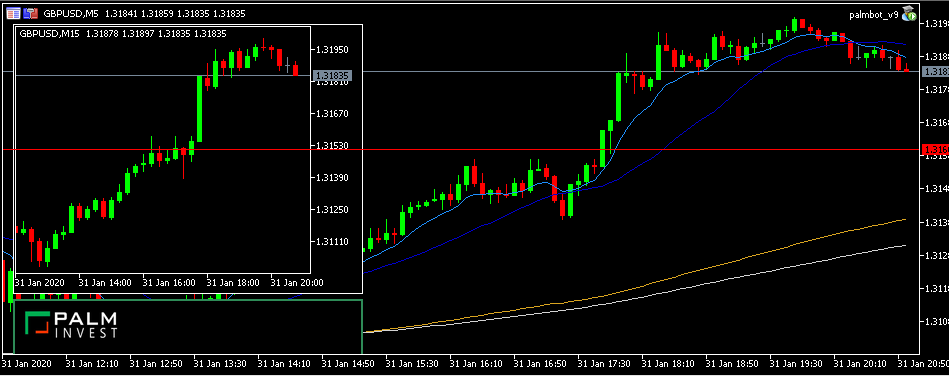
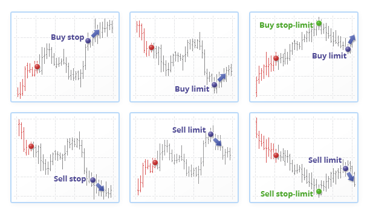
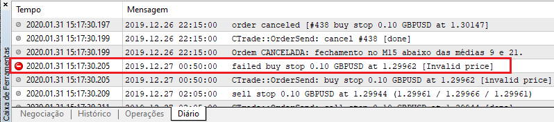
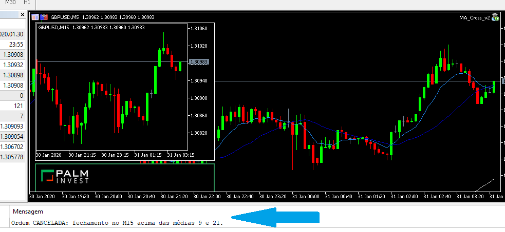
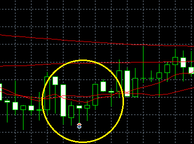
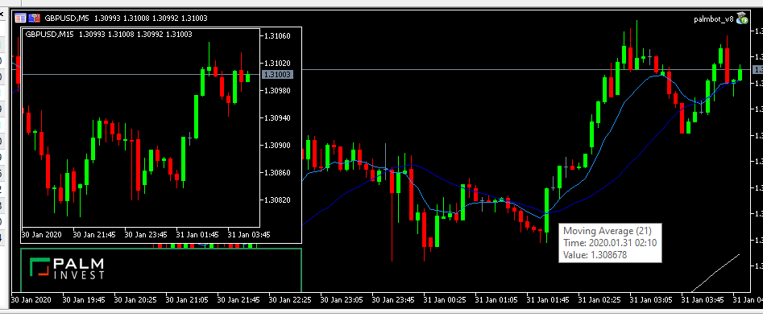

# PalmInvest - Robô de Investimentos
---
Duan Cleypaul

https://www.linkedin.com/in/duan-cleypaul-bb1715a5/

duancleypaul@hotmail.com

# Palmbot
---
### Características:

O robô utiliza o cruzamento de duas médias móveis, com posicionamento de ordens pendentes e takeprofit e stoploss sistemáticos.

#### Indicadores:

* **EMA9:** média exponencial de 9 períodos, calculada sob o fechamento;
* **SMA21:** média simples de 21 períodos, calculada sob a abertura;
* **EMA200:** média exponencial de 200 períodos, calculada sob o fechamento;
* **SMA200:** média simples de 200 períodos, calculada sobe o fechamento.

#### Tempos Gráficos:

* **M5:** gráfico principal;
* **M15:** gráfico secundário (subchart, inserido na mesma janela do gráfico principal).

#### Entradas, Saídas e Invalidação de Entrada:

* **Entrada:** cruzamento das médias de 9 e 21 (EMA9 e SMA21), no gráfico principal (M5);
* **Saída 1 (loss):** fechamento do candle no gráfico secundário (M15) acima/abaixo de ambas as médias EMA9 e SMA21;
* **Saída 2 (primária, gain):** toque em suporte/resistência inseridos pelo usuário;
* **Saída 3 (secundária, gain):** toque em qualquer uma das médias de 200 (EMA200 ou SMA200);
* **Invalidação:** ordem posicionada, porém não consumida, e o candle fecha acima/abaixo das médias EMA9 e SMA21, no gráfico M15.

#### Inputs:

* **MA_1_Period:** Período Média Curta (default = 9);
* **MA_2_Period:** Período Média Longa (default = 21);
* **numeroMagico:** Número mágico (defaut = 1234); 
* **contratos:** Número de lotes utilizados em cada operação (default = 0.1);
* **descolado:** Número de pontos a "descolar" a ordem (default = 5);
* **stringSR:** Níveis de suporte e resistência (default = 0);
* **inicio:** Horário mínimo permitido para enviar ordens (default = 09:00); 
* **termino:** Horário máximo permitido para enviar ordens (default = 17:00);
* **fechamento:** Após esse horário, todas as posições serão automaticamente encerradas (default = 17:30).

# Done
---
* **Entrada:** cruzamento das médias de 9 e 21 (EMA9 e SMA21), no gráfico principal (M5);
* **Saída 1 (loss):** fechamento do candle no gráfico secundário (M15) acima/abaixo de ambas as médias EMA9 e SMA21;
* **Saída 2 (gain):** toque em qualquer uma das médias de 200 (EMA200 ou SMA200);
* **Invalidação:** ordem posicionada, porém não consumida, e o candle fecha acima/abaixo das médias EMA9 e SMA21, no gráfico M15 (cancelamento de ordens abertas).

---
* **Subchart M15:** gráfico secundário para visualização de validação e/ou invalidação de entradas.
* **Painel Personalizado (parcialmente):** painel com logo personalizado e features solicitadas (botões, informações e dados em geral);



```python

```


```python

```

# To Do
---

* **Painel Dinâmico Personalizado:** um único painel que possua diferentes botões para visualizações diversas. Isso inclui visualização do subchart, histórico de negociações, gráfico de performance e quaisquer outros dados solicitados.
* **Saída 1 (primária, gain):** toque na S/R (os valores inseridos já foram identificados e devidamente tratados, mas falta debugar o plot das linhas);
* **AppDialog:** formato otimizado do painel (mais leve, mais rápido e com botão "fechar" que remove com segurança o EA);
* **Otimização paramétrica (opcional):** otimização dos parâmetros inseridos pelo usuário (inputs);
* **Otimização dos critérios de entrada e saída:** definir melhor os critérios de autorização de posicionamento, fechamento e cancelamento de ordens.
---
* **Entrada por rompimento médias 200, retest:** após rompimento, buylimit na média rompida pra aumento de posição;
* **Saída 1.1 (stop financeiro):** atingiu o limite de perda diário;
* **Critério de Invalidação atualizado:** se o setup ativar compra com médias de 200 abaixo das médias 9 e 21, ou se ativar venda com médias de 200 acima das médias de 9 e 21, A SAÍDA DEVE SER SOMENTE NOS NÍVEIS DE SUPORTE E RESISTENCIA;
* **Níveis de S/R:** o usuário deve poder alterar graficamente as linhas de S/R (mover, deletar, alterar a cor, etc). Caso isso seja feito, o vetor de valores S/R deve ser dinamicamente alterado. OBS: tentar tornar possível que o usuário TRACE as linhas de S/R e o EA capturar o nível de cada uma das linhas (filtrar para somente HORIZONTAL LINE no ativo e timeframe correntes).


```python

```


```python

```


```python

```

# Problemas
---

### 1. Ordens Limit e Stop


Uma ordem mal utilizada e/ou posicionada pode resultar no não reconhecimento do envio das ordens por parte do servidor, corretora ou qualquer parte envolvida no roteamento delas.

Veja o caso abaixo, a título exemplificativo:



**Formas de contornar o problema:**

**1. [VAMOS USAR ORDEM A MERCADO] Utilizar ordens a mercado;**

2. Continuar usando ordens STOP, porém com preenchimento do tipo RETURN.

### 2. Preenchimento das ordens

Definir qual o tipo de preenchimento das ordens é importante para afunilar o setup e tornar o envio das ordens mais eficaz.

**Tipos de preenchimento de ordens:**

* **FOK (Fill or Kill):** tudo ou nada;
* **IOC (Immediate or Cancel):** consumir o que der e cancelar o resto;
* **RETURN:** consumir o que der e deixar o resto na pedra.

### 3. Invalidação por fechamento no M15

O filtro de invalidação por fechamento no M15 é bom, mas precisa ser otimizado. A seguir, a imagem ilustra um caso bem sucedido do filtro. Primeiro, a ordem é posicionada após o cruzamento das médias:


Logo em seguida, ela é cancelada pelo critério de invalidação (candle no M15 fechou acima das médias):



Apesar desse filtro ter funcionado na situação acima, ele precisa ser reconsiderado. Há casos em que a ordem já é aberta com a condição de invalidação satisfeita ou muito próximo de ser satisfeita. É o caso da imagem abaixo:



### 4. Casos com bons potenciais não estão sendo validados

Existem casos em que a operação seria muito bem sucedida, porém é impedida pelo critério de invalidação no M15. A seguir, um trade que seria bem lucrativo deixou de ser feito por causa do fechamento do candle no M15:



Sabendo disso, o que fazer com o critério de invalidação? Continuar com ele ou adaptá-lo?

**EXCLUIR CRITÉRIO DE INVALIDAÇÃO POR FECHAMENTO NO M15. UTILIZAR APENAS PARÂMETRO DO M5.**

### 5. Saída 1: toque nas médias de 200

Como uma das opções de takeprofit é com toque na média de 200, é necessário filtrar a entrada. Por exemplo, caso uma compra seja feita de forma correta, porém com a média de 200 abaixo das médias 9 e 21, a compra será realizada, porém o takeprofit será acionado logo em seguida, uma vez que o preço atual já é maior ou igual às médias de 200. Esse problema é o mesmo ilustrado em figura anterior:


**SOLUÇÃO PARA O PROBLEMA:**
**NESSE CASO, SAIR SOMENTE NOS NÍVEIS DE S/R INSERIDOS PELO USUÁRIO**


### 6. Segundas-feiras

Abertura na segunda-feira geralmente ocasiona gaps (constatado em backtests). Gaps, quase que em 100% das vezes, antecedem cruzamento das médias 9 e 21 e implica em entrada equivocada. 

O que fazer? Entrar mesmo assim ou filtrar para esperar 1 ou mais candles após abertura?

**SOLUÇÃO: FILTRAR ENTRADAS PARA EVITAR O PRIMEIRO CANDLE DO DIA!**

# Cronograma
---
Disponibilidade até o dia 28/fevereiro (depois somente após 9/abril).


```python

```
